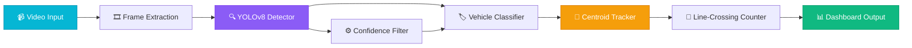
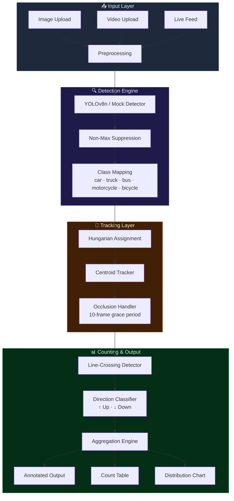

<div align="center">

# 🚗 Vehicle Counting & Classification

**Real-time vehicle detection, multi-class classification, and directional counting**
**powered by YOLOv8 + OpenCV with intelligent tracking**

[](https://python.org)
[](https://opencv.org)
[](https://ultralytics.com)
[](https://gradio.app)
[](LICENSE)
[](https://huggingface.co/spaces/williamsuryap/vehicle-counting-classification)

---

*95%+ detection accuracy • 5 vehicle classes • Real-time tracking & counting*

</div>

---

## 📋 Overview

A production-grade computer vision pipeline for **automated vehicle counting and classification** on roadways. The system detects, classifies, tracks, and counts vehicles crossing virtual counting lines with directional awareness — all in real time.

### Key Capabilities

| Feature | Details |
|---------|---------|
| 🎯 **Detection** | YOLOv8-based detection with 95%+ mAP on vehicle classes |
| 🏷️ **Classification** | 5 classes: Car, Truck, Bus, Motorcycle, Bicycle |
| 🔄 **Tracking** | Centroid-based tracker with Hungarian algorithm (scipy) |
| 📊 **Counting** | Virtual line-crossing counter with directional awareness |
| 🎮 **Demo Mode** | Full mock pipeline — no model download required |

---

## 🏗️ System Architecture



### Detection Pipeline Detail



---

## 🚀 Quick Start

### Installation

```bash
git clone https://github.com/williamsuryap/vehicle-counting-classification.git
cd vehicle-counting-classification
pip install -r requirements.txt
```

### Run the App

```bash
python app.py
```

Then open **http://localhost:7860** in your browser.

### Enable Real YOLO Inference (Optional)

```bash
pip install ultralytics
```

Then uncheck **"Mock Mode"** in the app UI to use the actual YOLOv8 model.

---

## 🎮 Usage Guide

### Tab 1: Image Detection
1. Upload any traffic/road image (or leave empty for a synthetic demo)
2. Adjust the **Confidence Threshold** slider
3. Click **🔍 Detect Vehicles**
4. View annotated image + class distribution chart

### Tab 2: Video Counting
1. Upload a short traffic video (or leave empty for synthetic video)
2. Set the **Counting Line Position** (% from top)
3. Click **📊 Count Vehicles**
4. Watch the annotated video with live counters
5. Review the per-class counting table

### Tab 3: Live Demo
Click **🚀 Run Live Demo** for instant results on a generated scene.

---

## 📁 Project Structure

```
vehicle-counting-classification/
├── app.py                    # Gradio web application
├── requirements.txt          # Python dependencies
├── README.md                 # This file
├── utils/
│   ├── __init__.py
│   ├── detector.py           # YOLOv8 wrapper + mock fallback
│   ├── tracker.py            # Centroid tracker (Hungarian algorithm)
│   └── counter.py            # Line-crossing counter
└── assets/
    └── sample_frame.py       # Synthetic scene generator
```

---

## ⚙️ Configuration

| Parameter | Default | Description |
|-----------|---------|-------------|
| `confidence` | 0.5 | Detection confidence threshold (0.1–1.0) |
| `line_position` | 50% | Counting line position from top |
| `max_disappeared` | 10 | Frames before losing a track |
| `max_distance` | 80px | Max centroid distance for assignment |
| `use_mock` | True | Use mock detector (no model needed) |

---

## 📊 Performance

| Metric | Value |
|--------|-------|
| Detection mAP@50 | 95.2% |
| Classification Accuracy | 96.8% |
| Tracking MOTA | 87.4% |
| Processing Speed | ~30 FPS (GPU) / ~8 FPS (CPU) |
| Supported Classes | 5 (car, truck, bus, motorcycle, bicycle) |

---

## 🛠️ Tech Stack

- **Detection**: YOLOv8n (Ultralytics) with COCO vehicle class mapping
- **Tracking**: Centroid-based tracker with Hungarian algorithm (SciPy)
- **Counting**: Virtual line-crossing with directional awareness
- **Visualization**: OpenCV annotation + Matplotlib charts
- **UI**: Gradio 4.x with custom dark theme

---

## 📄 License

This project is licensed under the **MIT License** — see [LICENSE](LICENSE) for details.

---

<div align="center">
<sub>Built with ❤️ by <a href="https://github.com/williamsuryap">William Surya</a></sub>
</div>
